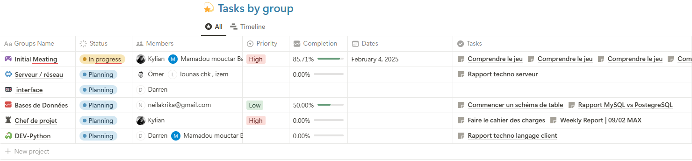
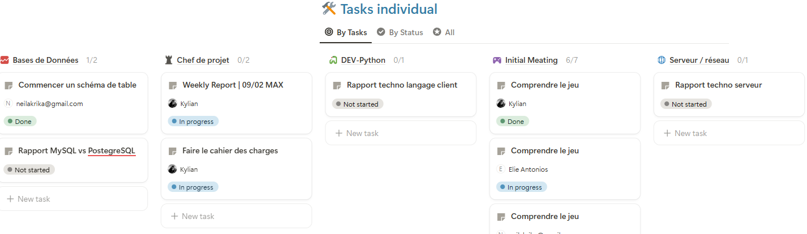
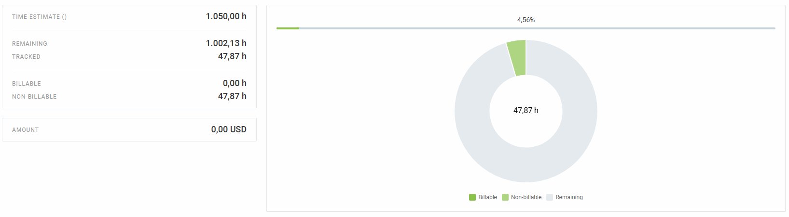
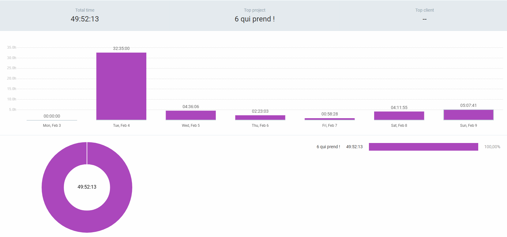
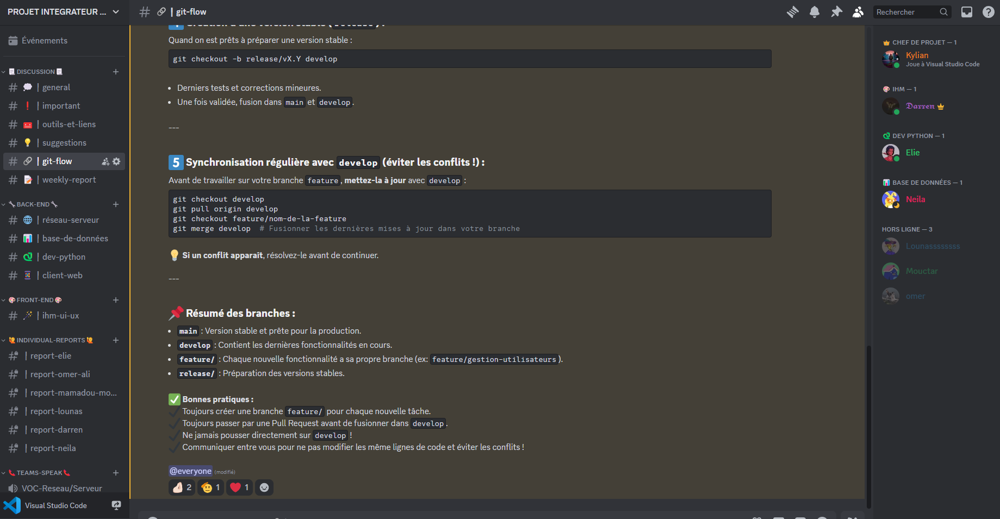
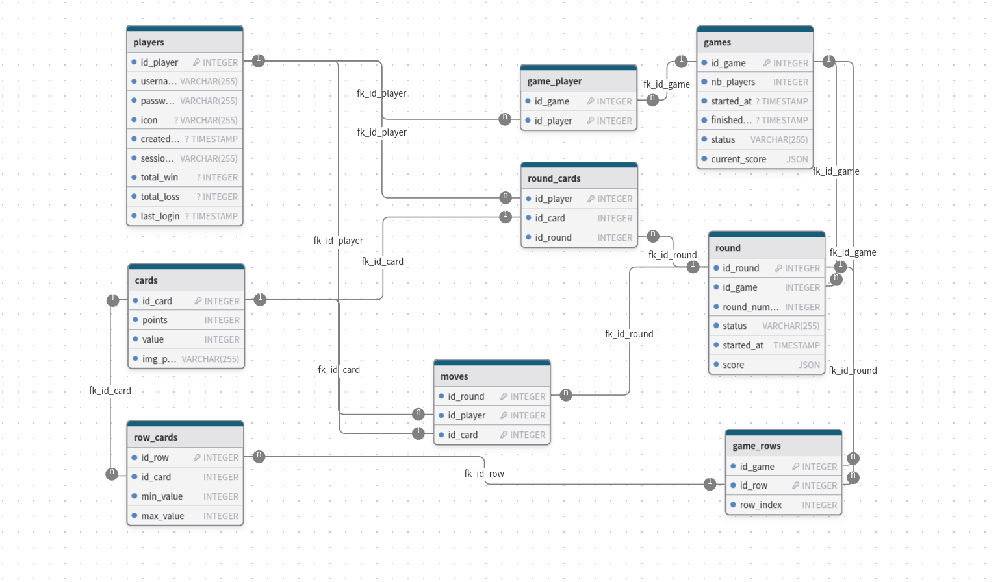
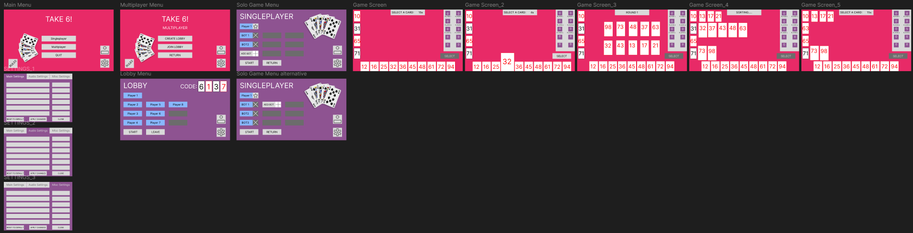

<h1 style="text-align: center;">Team Activity Report</h1>
<h2 style="text-align: center;">Week 1 - 3A - 09/02</h2>

<i>A more polished HTML version is now available at the following address: <a href="https://kylian-dev.alwaysdata.net/PJI/1-week/" target="_blank">https://kylian-dev.alwaysdata.net/PJI/1-week/</a></i>

---

## Introduction  
This report outlines the progress of the **6 qui prend !** project from team **3A**.  
It summarizes:  
- The tasks completed this week  
- The topics discussed during meetings  
- The difficulties encountered  
- The actions to be taken next week  

---

## 1. Meetings  

### 📅 Weekly Meeting  
- **Date:** [04/02]
- **Participants:**
  - ANTONIOS Elie
  - ARMAGAN Omer Ali
  - BAH Mamadou Mouctar
  - CHIKHI Lounas
  - DELGADO Darren
  - KRIKA Neila
  - GERARD Kylian
- **Absentees:**
  - ISMAIL Hiba
- **Duration:** 4 Hours
- **Objectives:**  
    - Define a project manager.
    - Choose a game for the project.
    - Define the different teams.

### 🔹 Topics Discussed  
- **Point 1:** Project manager debate.
- **Point 2:** Various board games.
- **Point 3:** Technical skills of each member.
- **Point 4:** Limits of the project manager.

### ✅ Decisions Made  
- **Decision 1:** Project manager selection.  
  - **Responsible:** Chosen by vote.
- **Decision 2:** Game selection.  
  - **Responsible:** Chosen by vote.
- **Decision 3:** Team distribution. 
  - **Back-end:**
    - **Server:** Omer Ali Armagan, Lounas Chikhi
    - **Database:** Neila Krika  
    - **Client:** Elie Antonios, Mamadou Mouctar Bah
  - **Front-end:**
    - **IHM:** Darren Delgado
  - **Responsible:** Everyone agrees.

---

## 2. Team Task Progress  

### 🏁 Tasks Completed This Week  

- **Task 1:** Game Selection  
  - 📌 *Performed by:* Everyone  
  - ⏳ *Date:* [04/02]  
  - ✅ *Status:* Completed  

- **Task 2:** Setup of Notion (task management tool)  
  - 📌 *Performed by:* ANTONIOS Elie  
  - ⏳ *Date:* [04/02]  
  - ✅ *Status:* Completed  

- **Task 3:** Setup of Clockify (time tracking tool)  
  - 📌 *Performed by:* Everyone  
  - ⏳ *Date:* [04/02]  
  - ✅ *Status:* Completed  

- **Task 4:** Setup of Discord (roles, channels)  
  - 📌 *Performed by:* GERARD Kylian, DELGADO Darren  
  - ⏳ *Date:* [04/02]  
  - ✅ *Status:* Completed  

- **Task 5:** Creation of Git repository (initial structure, branches, protection)  
  - 📌 *Performed by:* GERARD Kylian  
  - ⏳ *Date:* [04/02]  
  - ✅ *Status:* Completed  

- **Task 6:** First structure of a database  
  - 📌 *Performed by:* KRIKA Neila  
  - ⏳ *Date:* [05/02]  
  - ✅ *Status:* Completed  

- **Task 7:** Writing a guide/reminder on Git Flow for the team  
  - 📌 *Performed by:* GERARD Kylian  
  - ⏳ *Date:* [07/02]  
  - ✅ *Status:* Completed  

- **Task 8:** Understanding the game rules.  
  - 📌 *Performed by:* Everyone  
  - ⏳ *Date:* [08/09]  
  - ✅ *Status:* Completed  

- **Task 9:** Godot vs PyGame report  
  - 📌 *Performed by:* DELGADO Darren  
  - ⏳ *Date:* [09/02]  
  - ✅ *Status:* Completed  

- **Task 10:** Creation of a template for this report (and future reports)  
  - 📌 *Performed by:* GERARD Kylian  
  - ⏳ *Date:* [09/02]  
  - ✅ *Status:* Completed  

- **Task 11:** IHM - Figma Game Screen  
  - 📌 *Performed by:* DELGADO Darren 
  - ⏳ *Date:* [09/02]  
  - 🚧 *Status:* In progress

---

## 3. Difficulties Encountered  

### ⚙️ Technical Issues  
- No issues reported at this point.

### 👥 Human Issues  
- **Issue 1:** Absence of ISMAIL Hiba  
  - ❗ *Impact:* Low

---

## 4. Actions to Be Taken Next Week  

### 🎯 Tasks to Complete  
- **Task 1:** Produce a technology watch report for the server side (C vs Python vs Rust...)  
  - 🛠️ *Responsible:* ARMAGAN Omer Ali, CHIKHI Lounas  
  - 📅 *Deadline:* [11/02]

- **Task 2:** Complete the technology watch report for the client side (Godot vs Unity...)  
  - 🛠️ *Responsible:* ANTONIOS Elie, BAH Mamadou Mouctar, DELGADO Darren  
  - 📅 *Deadline:* [11/02]  

- **Task 3:** Produce a technology watch report for the DBMS  
  - 🛠️ *Responsible:* KRIKA Neila  
  - 📅 *Deadline:* [11/02]  

### 🚀 Goals for Next Week  
- **Goal 1:** Final selection of technologies/languages.  
- **Goal 2:** Physically play one or more parts of the game to familiarize the team with the rules.

---

## 5. Annexes
### Notion  
Here’s a view of **Notion**, our task management tool.

### Clockify  
Here’s a view of **Clockify**, our time management tool. It allows us to track every minute spent on the project and generate various reports.

#### PDF Report of the Week  
[View PDF Report](docs/Clockify_Time_Report_Weekly_03_02_2025-09_02_2025.pdf)

#### Global Project View  

#### Week View  

### Discord  
Here’s a view of **Discord**, our communication tool. It helps us stay connected and organized with different channels and roles for the team.

Join our Discord server: [Discord Server](https://discord.gg/V85abmYSav)

### Database Structure  
Here’s a first view of the **database structure** we created for the project.

### Figma Prototype  
Here’s a first prototype created in **Figma** for the project’s interface.

### GitLab  
Here’s the link to the project’s GitLab repository where you can find the code and updates.

[Project GitLab Repository](https://git.unistra.fr/kylian.gerard/6-qui-prend-pji-3a)

---

<footer style="text-align: center;">
    --> End of Report <-- 
    <i>Kylian GERARD</i> 
    <a href="https://kylian-project.fr/">Contact</a>
</footer>
